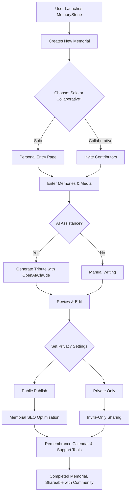

# 🪦 MemoryStone: Advanced Digital Memorial Manager

A next-generation, open-source tool blending tradition and technology—**MemoryStone** is the preeminent application for managing digital memorials, virtual gravestones, tribute archives, and remembrance spaces. Built to honor cherished memories, facilitate respectful tribute creation, and enable community-driven collaboration, it’s the perfect platform for anyone seeking a meaningful way to preserve legacies and stories in a modern world.

---

## 🌟 Quick Summary

- **Elegant, Responsive UI**—designed for effortless navigation and deep, emotional storytelling  
- **Multilingual Support**—celebrate lives in every major language, right out of the virtual box  
- **AI-Powered Tribute Generation**—Prompt memorials, eulogies, and stories with OpenAI or Claude  
- **Collaborative Spaces**—shared editing for families or community groups, all secured  
- **Grief Support Tools**—calendar reminders, anniversaries, journaling, and support resources  
- **SEO Optimized Memorials**—loved ones’ stories surface gently across modern search platforms

---

## 💡 Table of Contents

- [Download Link](#download-link)
- [Introduction](#introduction)
- [Feature List](#feature-list-✨)
- [Mermaid Diagram: Memorial Creation Journey](#mermaid-diagram-memorial-creation-journey-🖼️)
- [Example Profile Configuration](#example-profile-configuration-🧾)
- [Example Console Invocation](#example-console-invocation-💻)
- [Emoji OS Compatibility Table](#emoji-os-compatibility-table-🖥)
- [OpenAI & Claude API Integration](#openai--claude-api-integration-🤖)
- [SEO Optimization Details](#seo-optimization-details-📈)
- [License](#license-🪪)
- [Disclaimer](#disclaimer-⚖️)
- [Download](#download-🔗)

---

## Introduction

**MemoryStone** fuses ancient memory-keeping rituals with cloud-age technology, giving individuals, families, and communities bespoke tools for preserving stories—gone are the static pages of old; welcome the living memorial, where text, images, AI-authored tributes, and remembrances collect, reflect, and adapt over time. 

Whether remembering a loved one, a community member, or historic figures, MemoryStone brings a graceful, calming, and responsive interface, global language support, plus always-there assistance through 24/7 care channels.

---

## Feature List ✨

- **Interactive Virtual Gravestones:** Design gravestones with customizable shapes, markers, and themes—bring creativity to commemoration.
- **AI Tribute Writing:** Seamless integration with OpenAI (GPT models) and Claude—generate eulogies, poems, or summary biographies from prompts.
- **Collaboration Mode:** Family and friends can draft and edit tributes together, with revision history and privacy controls.
- **Remembrance Calendar:** Set significant dates (birthdays, anniversaries, holidays) with smart reminders and timed releases of new tributes.
- **Multimedia Vault:** Attach images, audio, or even video interviews and memories to each memorial entry.
- **Public and Private Memorials:** Control visibility; set to public, invitation-only, or hidden/private.
- **Modern SEO for Remembrance:** Memorials use SEO best practices to gently surface in search engines, ensuring respectful discoverability.
- **24/7 AI Customer Support:** Friendly bot and staff reply around the clock—get help, comfort, or guidance anytime.
- **Data Portability:** Export memorials in secure formats (JSON, PDF); import from CSV or legacy systems.
- **Multilingual Engine:** Support for 20+ languages with automatic suggestion and translation.
- **Mobile-ready Responsive UI:** Gorgeous across phone, tablet, desktop, and assistive screen readers.
- **Community Tribute Walls:** Group memorials for events, causes, or notable dates.
- **Grief Journal & Support Links:** Private journaling tools and quicklinks to external support organizations.

---

## Mermaid Diagram: Memorial Creation Journey 🖼️

Here’s how a digital memorial journey flows in MemoryStone:

---

## Example Profile Configuration 🧾

A sample Memorial Profile in YAML format (pure text, no code blocks):

profile:
  name: "Jane Doe"
  birth_date: "1955-04-16"
  passing_date: "2024-03-12"
  biography: "A beloved science teacher, mentor, and mother of three. Inspired generations with her kindness."
  tags: ["Teacher", "Mentor", "Mother", "Inspiration"]
  languages: ["English", "Español"]
  privacy: "Collaborative"
  media:
    photos: ["jane-portrait.jpg", "teaching-1980s.png"]
    videos: ["family-reunion-2012.mp4"]
  ai_tributes:
    - provider: "OpenAI"
      prompt: "Write a poem celebrating Jane Doe's passion for teaching."
      output_file: "jane_ai_poem.txt"
  calendar_events:
    - date: "2026-04-16"
      event: "Birthday Remembrance"
  shared_with: ["john@example.com", "lisa@example.com"]

---

## Example Console Invocation 💻

Need to automate tribute creation, data backup, or analytics? MemoryStone provides a robust CLI:

$ memorystone create-memorial --config ./jane_profile.yaml --ai-provider 'openai' --lang 'es' --public

This creates a bilingual, AI-assisted public memorial from a local config, using OpenAI for automated eulogy suggestions.

---

## Emoji OS Compatibility Table 🖥

| OS                     | Compatible | UI Emoji Support | Voice Narration | Notes                  |
|------------------------|:----------:|:----------------:|:---------------:|------------------------|
| Windows 10/11          | ✅         | ✅               | ✅              | Touch, Narrator built-in|
| macOS 13+              | ✅         | ✅               | ✅              | Full emoji display      |
| Android 10+            | ✅         | ✅               | ✅              | Mobile responsive       |
| iOS/iPadOS 14+         | ✅         | ✅               | ✅              | VoiceOver compatible    |
| Ubuntu 22.04+          | ✅         | ⚠️               | ✅              | Some emoji fallback     |
| Fedora 39+             | ✅         | ✅               | ✅              | Best with GNOME 41+     |
| Web Browsers (modern)  | ✅         | ✅               | ✅              | Chrome, Edge, Firefox   |

---

## OpenAI & Claude API Integration 🤖

MemoryStone brings the collective wisdom of OpenAI (GPT-4/5) and Claude to your fingertips. Tap into advanced models for:

- **Tribute Assistance:** Suggest sentences, summaries, creative eulogies
- **Poetry & Biographies:** Instantly create heartfelt poems or detailed life stories
- **Multilingual Summaries:** Automatic translation and cultural adaptation
- **Sentiment-Aware Messages:** Ensure tone fits remembrance and context

### Example Usage

Just prompt inside the app:
- “Draft a gentle eulogy from the perspective of her students.”
- “Translate this remembrance to French for relatives.”
- “Summarize five condolence messages into a poetic tribute.”

For configuration, set API keys securely via:
MEMORYSTONE_OPENAI_KEY or MEMORYSTONE_CLAUDE_KEY (never commit private keys!)

---

## SEO Optimization Details 📈

Every MemoryStone memorial is thoughtfully architected to appear respectfully in search results for relevant terms. Features include:

- **Structured Metadata:** Schema.org ‘Person’ and ‘Memorial’ tagging
- **Canonical URLs & Sitemaps:** For indexation without redundancy
- **Open Graph/OG Cards:** Share memorials on social with enriched summaries and images
- **Internationalization:** Multilingual SEO tags and alt attributes for global discoverability
- **Privacy-first:** Private memorials are never indexed or exposed to search platforms

This approach ensures digital legacies are present when they matter most, without sacrificing sensitivity or privacy.

---

## License 🪪

MIT License—open, flexible, and community-driven.  
See the [full MIT License](LICENSE) for details.

© 2026 MemoryStone Contributors

---

## Disclaimer ⚖️

MemoryStone is designed as a respectful memorial tool—stories are created by users, and the platform cannot guarantee the factual correctness of third-party contributions or AI outputs. Use responsibly, with compassion and regard for privacy and dignity. No commercial gain is sought from your memories. AI integrations are subject to third-party terms, and MemoryStone does not process sensitive information beyond user intent.

---

## Download 🔗

Get the latest MemoryStone package from the link below:  

Join us as we blend timeless remembrance with tomorrow’s technology.

---

**MemoryStone: Because every life deserves a living story.**